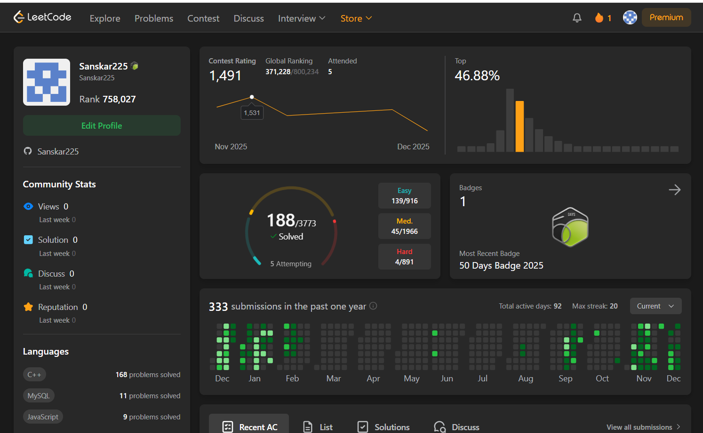

LeetCode Practice Archive

A structured repository documenting my complete LeetCode journey—problems solved, patterns learned, and daily progress.

Overview

This repository is dedicated to tracking and organizing all of my LeetCode solutions, including:

Daily LeetCode (POTD)

Topic-wise problems

Difficulty-wise classification

Contest submissions

Notes and optimized approaches

The goal is long-term improvement in problem-solving, competitive programming, and interview preparation through consistent practice.

My LeetCode Profile

Sanskar Sinha
Profile Link:
https://leetcode.com/u/Sanskar225/
///